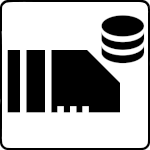

[](https://github.com/siemens)
[](https://github.com/industrial-edge)
[](https://github.com/siemens/edgeshark)

# IED App Engine Data Access

[](https://pkg.go.dev/github.com/siemens/ieddata)
[](https://img.shields.io/github/license/siemens/ieddata)


[](https://goreportcard.com/report/github.com/siemens/ieddata)


`iedata` provides querying information about a Siemens Industrial Edge (virtual)
device from an app inside the IE(v)D.

> [!NOTE]
> 
> This package is "CGO-free" as it leverages the
> [modernc.org/sqlite](https://pkg.go.dev/modernc.org/sqlite) sqlite3 driver
> module. When using the `ieddata` module, please make sure that your main
> module's `go.mod` (indirectly) requires the `modernc/libc` module _in the
> same_ version as required by [`modernc.org/sqlite`'s
> `go.mod`](https://gitlab.com/cznic/sqlite/-/blob/v1.38.0/go.mod).

`ieddata` is part of the "Edgeshark" project that consist of several
repositories:
- [Edgeshark Hub repository](https://github.com/siemens/edgeshark)
- [G(h)ostwire discovery service](https://github.com/siemens/ghostwire)
- [Packetflix packet streaming service](https://github.com/siemens/packetflix)
- [Containershark Extcap plugin for
  Wireshark](https://github.com/siemens/cshargextcap)
- support modules:
  - [turtlefinder](https://github.com/siemens/turtlefinder)
  - [csharg (CLI)](https://github.com/siemens/csharg)
  - [mobydig](https://github.com/siemens/mobydig)
  - 🖝 **ieddata** 🖜

## Usage

The following example queries a Siemens Industrial Edge (virtual) device's...
- ...device name and its owner,
- ...and the list of installed applications.

Error handling has been left out for brevity.

```go
db, _ := ieddata.Open("platformbox.db")
defer db.Close()

di, _ := db.DeviceInfo()
fmt.Printf("device name: %s\nowner name: %s\n", di["deviceName"], di["ownerName"])

apps, _ := db.Apps()
slices.SortFunc(apps, func(a, b ieddata.App) int { return strings.Compare(a.Title, b.Title) })
for _, app := range apps {
   fmt.Printf("app: %q %s\n", app.Title, app.Id)
}
```

> _Nota bene:_ we first copy the IED's `platformbox.db` in a temporary location
> and the open only the copy.

## DevContainer

> [!CAUTION]
>
> Do **not** use VSCode's "~~Dev Containers: Clone Repository in Container
> Volume~~" command, as it is utterly broken by design, ignoring
> `.devcontainer/devcontainer.json`.

1. `git clone https://github.com/siemens/ieddata`
2. in VSCode: Ctrl+Shift+P, "Dev Containers: Open Workspace in Container..."
3. select `ieddata.code-workspace` and off you go...

## Supported Go Versions

`morbyd` supports versions of Go that are noted by the [Go release
policy](https://golang.org/doc/devel/release.html#policy), that is, major
versions _N_ and _N_-1 (where _N_ is the current major version).

## Deployment

Please note that an application using this Go module needs to have capability
`CAP_SYS_PTRACE` requested in its composer file, as well as your binary needs to
be executed with `CAP_SYS_PTRACE` also _effective_, not just permitted. If you
run your binary under a non-UID0 user, then you need to assign file capabilities
to your binary (see also
[setcap(8)](https://man7.org/linux/man-pages/man8/setcap.8.html)).

Additionally, you need to deploy any container that leverages this Go module
with `pid:host` in order to access the file system view (mount namespaces) of
other containers.

# Contributing

Please see [CONTRIBUTING.md](CONTRIBUTING.md).

## License and Copyright

(c) Siemens AG 2023

[SPDX-License-Identifier: MIT](LICENSE)
